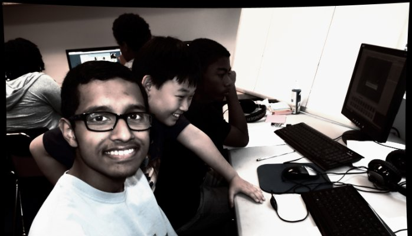

Chelsea School is holding its 2nd annual #STEAM/#STEM education program again in Summer 2016. Emphasis is on programming fundamentals, game design, environmental science, and creative writing.

Our Summer 2015 program received very high marks from participants and parents/guardians.

We are, once again, emphasizing that the humanities are integral to understanding STEM fields and the works they produce.

To make the program more available to the kids in the communities we serve - MD and DC, **we're committing to reducing the cost by 65% - while increasing staff**.

You can support us in this initiative at this [GoFundMe drive](https://www.gofundme.com/maw5ds).

Learn more about the program at [Chelsea School's home](http://www.chelseaschool.edu/summer/stem).

If you'd like to contact us, please see this [form](https://form.jotform.com/61012996705962).

Thanks so much for taking the time to read and learn more about this program. We couldn't be more excited.

If you want to see more students able to take part, please consider charitable giving at this [GoFundMe Campaign](https://www.gofundme.com/maw5ds).

The two-week program begins July 11th.

After-care is available.

---

## Curriculum Overview

(From http://www.chelseaschool.edu/summer/stem):

### Introduction to Coding

This game-based introduction to the logic underlying software engineering focuses on coding fundamentals using visual & text-based interpreted languages & their syntaxes; in addition, this session prepares participants for our Game Design and Development Session.

### Game Design & Development

Participants will have hands-on experience building a game in professional game development engines. Using 3D models & code produced in C# & Javascript, they will assemble the terrain, objects & other elements of the game, capture input from users & script game physics & AI behavior.

### Arts & Technology:

Participants will explore the role of arts & creativity in technology, including the ways in which literature, visual arts, & music influence — and are influenced by — science & technology. Participants will engage in hands-on projects including creative writing workshops, crafts & more.

### The Living World

Participants will engage in activities exploring the world of Environmental and Earth Sciences and the scientific method in a real world environment. Activities will be planned for participants to observe and learn to recognize biological processes occurring in nature and study the impact that human beings have on the world around them.
